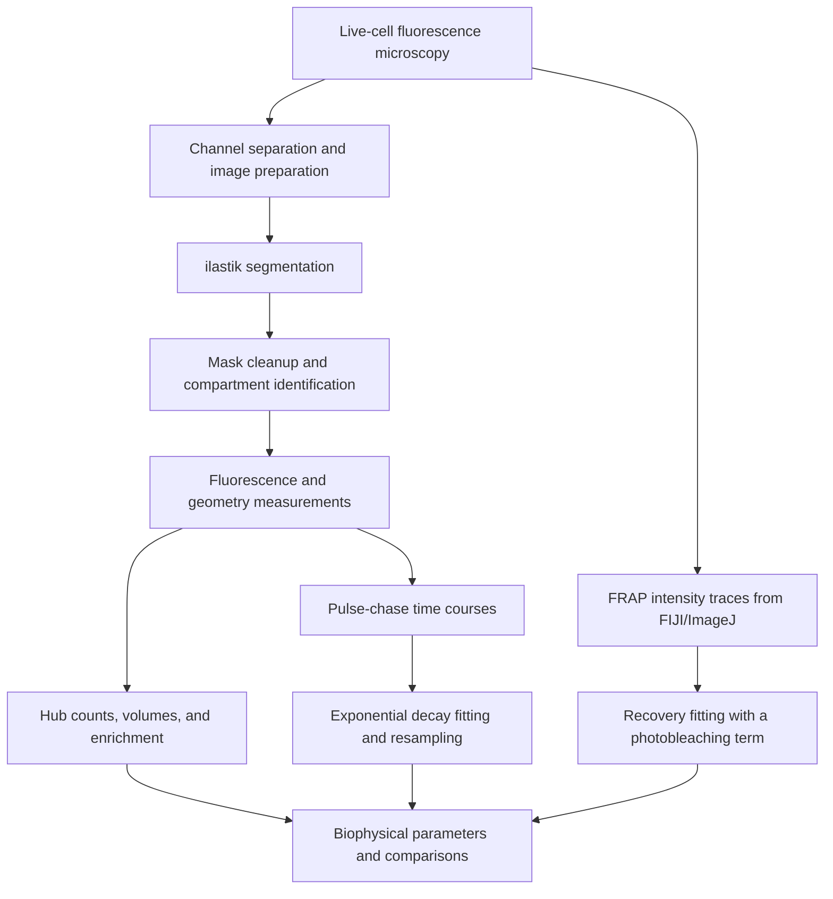

# Quantitative Analysis and Modeling of the Notch Transcriptional Response

### Quantitative live-cell imaging, nuclear-hub analysis, and kinetic modeling of RBPJ and NICD dynamics.

## Table of Contents

- [Overview](#overview)
- [Goal](#goal)
- [Scientific Context](#scientific-context)
- [Computational Pipeline](#computational-pipeline)
- [Image Processing and Signal Quantification](#image-processing-and-signal-quantification)
- [Nuclear-Hub Analysis](#nuclear-hub-analysis)
- [Pulse-Chase Modeling and Parameter Inference](#pulse-chase-modeling-and-parameter-inference)
- [FRAP Modeling](#frap-modeling)
- [Statistical Analysis and Uncertainty](#statistical-analysis-and-uncertainty)
- [Results](#results)
- [Key Findings](#key-findings)
- [Split-HaloTAG Reporter Development](#split-halotag-reporter-development)
- [Repository Structure](#repository-structure)
- [Requirements and Analysis Workflow](#requirements-and-analysis-workflow)
- [Reproducibility Notes](#reproducibility-notes)
- [Thesis and Related Work](#thesis-and-related-work)

---

## Overview

This project develops a quantitative framework for studying the **nuclear organization, mobility, and stability of the Notch signaling components RBPJ and NICD**. Live-cell fluorescence microscopy is combined with image segmentation, three-dimensional measurements, kinetic model fitting, and statistical validations and resamplings to connect experimental observations with measurable biophysical parameters.

The experimental platform uses **endogenous HaloTAG labeling** of RBPJ and Notch1 in mouse kidney cells. The analysis follows labeled proteins across spatially and temporally to measure nuclear-hub properties, compare protein lifetimes, and examine how Notch activation and altered RBPJ expression affect these behaviors.

I developed Python scripts to process microscopy images, quantify fluorescence within segmented compartments, fit fluorescence decay and recovery curves, and summarize variation across experimental conditions. The repository also includes analysis tools for a supplementary split-HaloTAG reporter-development project.

This work forms part of my doctoral thesis, *Quantitative Analysis and Modeling of the Notch Transcriptional Response*, completed under the supervision of Prof. David Sprinzak at Tel Aviv University in September 2025.

## Goal

The goal is to **quantify how the spatial organization and turnover of RBPJ and NICD relate to the Notch transcriptional response**.

The analysis addresses four connected questions:

- How is RBPJ distributed between the nucleoplasm and nuclear hubs?
- Does Notch activation change RBPJ hub properties, mobility, or lifetime?
- How do RBPJ and NICD differ in their turnover and mobility?
- How does overexpression of wild-type or DNA-binding-impaired RBPJ affect hub organization and NICD stability?

The computational outputs include fluorescence enrichment, hub counts and volumes, concentration estimates, decay rates, protein half-lives, and FRAP recovery parameters.

## Scientific Context

The **Notch signaling pathway** regulates cell-fate decisions through communication between neighboring cells. Ligand binding triggers receptor cleavage and releases the **Notch intracellular domain (NICD)**, which enters the nucleus and forms a transcriptional activation complex with the DNA-binding factor **RBPJ**. RBPJ also participates in transcriptional repression through interactions with co-repressors.

Understanding this transcriptional switch requires measurements of both the abundance and the dynamics of its components. Protein concentration, nuclear localization, molecular mobility, and turnover can influence the availability of activation and repression complexes, as well as the ratio between them.

My thesis investigates these properties using mK4 mouse kidney cells carrying CRISPR-mediated HaloTAG insertions in endogenous **RBPJ** or **Notch1**. Fluorescent HaloTAG ligands enable live-cell imaging and pulse-chase measurements. **H2B-Cerulean** and **NLS-Cerulean-NLS** provide complementary markers for nuclear organization and segmentation.

The main experimental comparisons are:

| Condition or perturbation | Purpose |
|---|---|
| Dll1-Fc-coated substrate | Activate endogenous Notch signaling |
| DAPT | Inhibit NICD release; washout allows an activation pulse |
| SenexinA | Examine the relationship between CDK8-dependent regulation and protein turnover |
| Wild-type RBPJ overexpression | Test how increased RBPJ abundance affects hubs and NICD stability |
| AOS-associated, DNA-binding-impaired RBPJ, labeled `RBPJ(S)` in the scripts | Examine the contribution of RBPJ DNA binding |
| Trichostatin A, or TSA | Examine hub organization after inhibition of histone deacetylases |

The AOS comparison refers to the Adams–Oliver syndrome-associated RBPJ variant studied in the thesis. Conclusions below describe the experimental cell system and conditions tested.

## Computational Pipeline



These are related experimental workflows with intermediate files and manual analysis steps. The repository preserves the scripts used for each workflow; segmentation, spreadsheet preparation, and some downstream comparisons occur outside the Python scripts.

## Image Processing and Signal Quantification

### Channel Separation and Segmentation

Microscopy files are read using **Bio-Formats**, with OME metadata providing image dimensions and pixel types. Preparation scripts separate fluorescence channels into TIFF stacks for segmentation and measurement.

Some time-lapse acquisitions store alternating channels along the time dimension. The corresponding scripts reconstruct individual channel time series using the acquisition order. Confocal workflows instead read each channel across the Z-stack.

**ilastik** supplies segmentation masks for nuclei, background, hubs, and, where required, nucleoli. Representative images are used to train the segmentation models before applying them to the remaining images. Python then converts the selected label classes into binary masks.

For nuclear-hub analysis, mask cleanup includes connected-component labeling, selection of the largest nuclear component, and hole filling. The AOS workflow also applies binary erosion. These operations restrict subsequent measurements to the intended nuclear region.

### Compartment-Based Fluorescence Measurements

For a fluorescence image $I$ and a binary compartment mask $M$, the basic mean-intensity measurement is:

$$
\overline{I}_M = \frac{\sum_p M_p I_p}{\sum_p M_p}
$$

where $p$ indexes pixels or voxels. Multiplication by the mask removes signal outside the selected compartment, and division by the mask size gives its mean fluorescence.

Pulse-chase workflows measure nuclear and background signals separately and subtract the background contribution. They also record mask area and write control images for inspection. Individual scripts apply additional intensity filters: the RBPJ and Fig. 13 NICD scripts exclude the brightest portion of positive masked pixels, while the Fig. 15 AOS script uses a fixed intensity cutoff.

### Fluorescence Calibration

[`CalibrateJFX554.py`](CalibrateJFX554.py) fits the fluorescence response of known JFX554 concentrations to a linear model:

$$
I = a c + b
$$

where $c$ is dye concentration, $a$ is the calibration slope, and $b$ is the intercept. The corresponding concentration estimate is:

$$
c = \frac{I-b}{a}
$$

The script contains measurements at **75, 150, 300, and 600 nM** and performs **2,000 Gaussian resampling iterations** to estimate uncertainty in the calibration coefficients. The thesis uses this calibration to interpret HaloTAG fluorescence as concentration under matched imaging conditions. The script itself returns calibration-parameter distributions; it does not automatically convert every image measurement into concentration.

## Nuclear-Hub Analysis

The hub workflows quantify RBPJ organization in three dimensions. Segmented hubs are labeled as connected components, allowing the analysis to measure individual structures and summarize them within each nucleus.

For each cell, the analysis measures:

- The number of detected hubs and their voxel counts.
- Mean fluorescence within hubs and the surrounding nucleoplasm.
- Fluorescence within nucleoli where those masks are available.
- Hub enrichment relative to nucleoplasmic fluorescence.
- The fraction of total nuclear fluorescence localized in hubs.

Hub enrichment is expressed as:

$$
E = \frac{\overline{I}_{\mathrm{hub}}}{\overline{I}_{\mathrm{nucleoplasm}}}
$$

An enrichment greater than one indicates a higher mean signal in the hub than in the surrounding nucleoplasm. The nucleoplasmic reference excludes hubs and nucleoli in the relevant measurement scripts.

Voxel counts are converted to physical volume through:

$$
V_{\mathrm{hub}} = N_{\mathrm{voxels}}\,\Delta x\,\Delta y\,\Delta z
$$

The supplied analysis scripts use a voxel volume of **0.003284566056 µm³** for the original confocal acquisition. This value must match the image calibration when the scripts are used on other data.

The **AOS hub analysis** measures endogenous HaloTAG-RBPJ, H2B-Cerulean, and overexpressed iRFP-RBPJ in the same image stacks. Ordinary least-squares regression relates mean hub volume to nucleoplasmic iRFP signal, allowing wild-type and mutant RBPJ to be compared while accounting for variation in expression level. The script includes slope and intercept comparisons, along with an additional analysis excluding wild-type cells with mean hub volumes of 10 µm³ or more.

## Pulse-Chase Modeling and Parameter Inference

### Measuring Protein Turnover

In the HaloTAG pulse-chase experiments, a population of proteins is fluorescently labeled and followed after the labeling phase ends. The decrease in nuclear fluorescence provides a time course from which an apparent protein half-life can be inferred.

The RBPJ analysis follows relatively slow fluorescence decay over **48 hours**, with a 20-minute sampling interval in the fitting script. NICD analyses use **16-hour** time courses sampled every 5 minutes. Because NICD first accumulates in the nucleus after DAPT washout, the dedicated NICD fitting scripts start the decay fit **30 minutes after washout** and normalize to that starting point.

### Exponential Decay with a Residual Signal

The dedicated pulse-chase fitting scripts use:

$$
F(t) = (1-B)e^{-kt} + B
$$

| Parameter | Meaning |
|---|---|
| $F(t)$ | Normalized fluorescence at time $t$ |
| $k$ | Decay-rate constant, named `C1` in the fitting scripts |
| $B$ | Residual signal or fitted plateau, named `C2` |

This model satisfies $F(0)=1$ and allows the signal to approach a nonzero plateau. The half-life of the decaying component is:

$$
t_{1/2} = \frac{\ln 2}{k}
$$

It describes halving of the signal above the fitted plateau. Time is measured in minutes in the pulse-chase fitting scripts.

### Iterative Grid Search

The `C1C2Finder` routines search candidate decay rates and plateau values by minimizing the sum of squared differences:

$$
L(k,B) = \sum_i \left[F(t_i;k,B)-y_i\right]^2
$$

Each refinement evaluates **11 candidate decay rates** and **51 candidate plateau values**. The decay-rate range is narrowed around the best-scoring region over **16 iterations**, while the plateau grid remains fixed. This search is repeated for the synthetic datasets generated during uncertainty analysis.

The image-measurement scripts also retain exploratory fits using SciPy's `curve_fit`, including comparisons between single- and double-exponential decay in the Fig. 13 NICD workflow. The dedicated `*_fit.py` files implement the exponential-plus-plateau resampling workflow described here.

## FRAP Modeling

**Fluorescence recovery after photobleaching (FRAP)** measures the return of fluorescence to a bleached region and provides a complementary view of molecular mobility. The experiments compare RBPJ within hubs and in the nucleoplasm, as well as nuclear NICD.

[`FRAP/Frap_py_fit_with_bleach_correction.py`](FRAP/Frap_py_fit_with_bleach_correction.py) reads intensity traces from an Excel workbook, normalizes them to the prebleach intensity, and subtracts the immediate postbleach signal from the recovery traces. It fits the following function:

$$
R(t) = A\left(1-e^{-k_{\mathrm{rec}}t}\right)e^{-k_{\mathrm{bleach}}t}
$$

| Parameter | Meaning |
|---|---|
| $k_{\mathrm{rec}}$ | Fluorescence-recovery rate, `C1` |
| $A$ | Recovery-amplitude parameter, `C2` |
| $k_{\mathrm{bleach}}$ | Ongoing photobleaching rate, `C3` |

The recovery term describes fluorescence returning to the region, while the multiplicative decay term accounts for signal loss during continued imaging. The script uses bounded nonlinear least squares and assigns larger `sigma` values to later time points, reducing their influence on the fit.

Recovery times are estimated numerically by searching for the time at which $R(t)/A=0.5$. This is the implemented definition; it differs from simply calculating $\ln(2)/k_{\mathrm{rec}}$ when the photobleaching term is nonzero. The thesis further interprets recovery times using the bleached-region geometry to estimate diffusion coefficients. That conversion is not implemented in this script.

The FRAP recovery time reflects mobility over seconds and is distinct from the protein-turnover half-life measured over minutes to hours by pulse-chase experiments.

## Statistical Analysis and Uncertainty

### Parametric Resampling

The pulse-chase fitting scripts generate **500 synthetic datasets** by drawing a fluorescence value independently at each time point from a Gaussian distribution:

$$
y_i^{(b)} \sim \mathcal{N}(\mu_i,\sigma_i^2)
$$

Here, $\mu_i$ is the measured mean and $\sigma_i$ is the supplied experimental error value. Each synthetic time course is fitted separately, producing distributions of decay rates, plateau values, and derived half-lives.

This propagates the supplied measurement variability through the model-fitting procedure. Its interpretation depends on whether the input spreadsheet contains standard deviations or standard errors; the scripts read these values from fixed spreadsheet locations without verifying their meaning.

The active implementations execute the resampling fits **sequentially**. Multiprocessing alternatives are present as commented code.

### Complementary Analyses

- **Calibration:** 2,000 resampled linear fits, with 2.5th and 97.5th percentile bounds for the slope and intercept.
- **TSA comparison:** 2,000 resampled comparisons using embedded summary measurements to estimate fractional changes in fluorescence enrichment.
- **AOS hub analysis:** linear regressions and comparisons of fitted slopes and intercepts.
- **Visualization:** time-course uncertainty bands, half-life histograms, volume distributions, and bar plots with individual observations and standard-error bars.

Confidence-interval calculations differ between the pulse-chase scripts. The Fig. 13 NICD fit uses the **0.5th and 99.5th percentiles**, corresponding to a central 99% interval. The Fig. 15 AOS fit currently uses the **0.5th and 97.5th percentiles**, an asymmetric percentile interval. The RBPJ script transforms the fitted rate mean plus or minus one standard deviation. These outputs should be interpreted according to their actual calculation, rather than treated as a uniform 95% or 99% interval.

## Results

The following values and observations are **reported in the thesis**, primarily Section 4.1 and Figures 6–15. They have not been recalculated from raw data for this README. The uncertainty conventions follow the individual thesis figures; fluorescence and volume summaries below use mean ± standard error, while the lifetime results are reported with bootstrap-based uncertainty.

### RBPJ Forms Enriched Nuclear Hubs

Quantitative confocal imaging revealed RBPJ enrichment in distinct nuclear hubs:

| Measurement | Thesis-reported value | Source |
|---|---|---|
| RBPJ concentration in the nucleoplasm | 532 ± 16 nM | Figure 6 |
| RBPJ concentration within hubs | 1,110 ± 31 nM | Figure 6 |
| Mean hub volume | 1.31 ± 0.07 µm³ | Figure 6 |
| Mean nuclear volume | 660 ± 27 µm³ | Figure 6 |
| Mean number of hubs per nucleus | 12.7 ± 0.6 | Figure 6 |

The hub-characterization dataset included **118 cells across four biological replicates**. RBPJ concentration within hubs was approximately twice that of the surrounding nucleoplasm, while most nuclear RBPJ remained outside the hubs.

RBPJ hubs co-localized with H2B-Cerulean. Acute Notch activation produced no detectable change in normalized hub fluorescence under the tested conditions, and NICD did not form comparable visible hubs. FRAP analysis indicated lower RBPJ mobility within hubs than in the surrounding nucleoplasm.

### RBPJ and NICD Have Different Turnover Times

| Protein and condition | Reported half-life | Source |
|---|---|---|
| RBPJ, without Dll1-Fc | 710 ± 23 min | Figure 12 |
| RBPJ, Dll1-Fc with DAPT | 742 ± 9 min | Figure 12 |
| RBPJ, Dll1-Fc activation | 738 ± 9 min | Figure 12 |
| NICD, Dll1-Fc activation | 125.2 ± 7.5 min | Figure 13 |
| NICD, Dll1-Fc with SenexinA | 164 ± 9.6 min | Figure 13 |

RBPJ was substantially longer-lived than NICD. No significant difference in RBPJ half-life was detected between activated and non-activated conditions. SenexinA prolonged NICD lifetime in the corresponding experiment.

### RBPJ Overexpression Extends NICD Lifetime

The separate overexpression experiment reported:

| Condition | NICD half-life | Source |
|---|---|---|
| Activated control | 119 ± 5.9 min | Figure 15 |
| Wild-type RBPJ overexpression | 144 ± 16 min | Figure 15 |
| AOS RBPJ(S) overexpression | 191 ± 27 min | Figure 15 |

Wild-type RBPJ overexpression extended NICD lifetime, with a larger increase in the presence of the DNA-binding-impaired AOS variant. The associated NanoLuc reporter assay did not detect significant differences among the activated samples, so a longer NICD lifetime did not translate into a detectable increase in reporter output in this experiment.

Both overexpressed RBPJ variants formed enlarged hubs. Mean hub volumes were **4.24 ± 0.42 µm³** for wild-type iRFP-RBPJ and **2.46 ± 0.25 µm³** for the AOS variant (Figure 14), compared with the endogenous baseline of **1.31 ± 0.07 µm³** from Figure 6. Regression against nucleoplasmic signal supported a difference between the variants beyond their variation in expression level.

### Chromatin Perturbation and Live-Cell Organization

TSA treatment reduced normalized H2B-Cerulean hub signal more strongly than HaloTAG-RBPJ hub signal. The thesis reports remaining signal fractions of **0.67 ± 0.05** and **0.91 ± 0.04**, respectively (Figure 9). Paraformaldehyde fixation rapidly disrupted the visible RBPJ hubs, supporting the importance of examining these structures in living cells.

The thesis proposes that RBPJ hubs may participate in transcriptional repression and that excess RBPJ may temporarily sequester NICD away from productive DNA binding. These are mechanistic interpretations of the observations. The analyses do not directly establish hub composition, a phase-separation mechanism, or the genomic targets of individual hubs.

## Key Findings

- **RBPJ is spatially enriched in nuclear hubs**, with approximately twice the concentration found in the surrounding nucleoplasm.
- **RBPJ and NICD have distinct dynamics:** RBPJ persists for roughly 12 hours, whereas NICD turns over on a timescale of roughly 2 hours in the baseline experiments.
- **Acute Notch activation did not measurably reorganize RBPJ hubs or change its lifetime** under the tested conditions.
- **RBPJ mobility is reduced within hubs**, consistent with interactions that constrain its movement locally.
- **Wild-type and AOS RBPJ overexpression enlarge hubs and prolong NICD lifetime**, with the AOS variant producing the greater extension of NICD lifetime.
- **Hub formation persists with DNA-binding-impaired RBPJ**, while wild-type RBPJ forms larger hubs, suggesting that DNA binding contributes to hub organization without being sufficient to explain it.

## Split-HaloTAG Reporter Development

The supplementary project aimed to distinguish **NICD–RBPJ complexes from the individual proteins** using a complementation-based HaloTAG reporter. The thesis describes testing conventional split-HaloTAG constructs and a **Domain Switch and Split (DoSS)** approach, using rapamycin-induced FRB/FKBP association as an experimental test system.

The [`SplitHaloTAG/`](SplitHaloTAG/) scripts support channel separation, reconstruction of segmented image time series, background-corrected fluorescence measurement, and Excel export. They quantify the fluorescence generated by candidate constructs.

The thesis reports promising inducible constructs and improvements in signal generation, but the work remained a reporter-development proof of concept. It did **not** produce a validated reporter for tracking NICD–RBPJ complexes in the main experiments, and DoSS reversibility was not established.

## Repository Structure

```text
Quantitative-analysis-and-modeling-of-the-Notch-transcriptional-response/
├── README.md
├── CalibrateJFX554.py
├── Measure_RBPJ_hubs/
│   ├── Seperate_Channels_2Ch.py
│   ├── save_cleaned_JF_Images.py
│   ├── Measure_RBPJ_hubs.py
│   └── Analize_hubs.py
├── Measure_hubs_AOS/
│   ├── Seperate3Channels.py
│   ├── Scave_Cleaned_AOS.py
│   └── Measure_AOS_hubs.py
├── RBPJ_PulseChase/
│   ├── RBPJ_PulseChase.py
│   └── RBPJ_PulseChase_fit.py
├── NICD_PulseChase/
│   ├── Fig13/
│   │   ├── NICD_PulseChase.py
│   │   └── NICD_PulseChase_fit.py
│   └── Fig15/
│       ├── AOS_transient.py
│       └── AOS_transient_Fit.py
├── FRAP/
│   └── Frap_py_fit_with_bleach_correction.py
├── TSA/
│   ├── Seperate_Channels_2Ch_TSA.py
│   ├── Save_cleaned_nucleus.py
│   ├── meeasure_Seg_nucleoli.py
│   └── Analyze_TSA.py
├── SplitHaloTAG/
│   ├── SeperateChannelsTimeOME2ChannelsPrepForIlastik.py
│   ├── SeperateChannelsTimeOME3ChannelsPrepForIlastik.py
│   ├── fuseBack.py
│   ├── fuseBack3channels.py
│   ├── measure2Channels.py
│   └── Split
└── Bars_n_Scatter_plot/
    ├── GUI_plotter3
    ├── GUI_plotter3_set_of_2.py
    └── GUI_plotter3_set_of_3.py
```

Existing filenames are preserved, including their original spelling.

| Location | Main responsibility |
|---|---|
| [`CalibrateJFX554.py`](CalibrateJFX554.py) | Fluorescence calibration and resampled linear fitting |
| [`Measure_RBPJ_hubs/`](Measure_RBPJ_hubs/) | Two-channel preparation, nuclear cleanup, hub measurements, and distribution plots |
| [`Measure_hubs_AOS/`](Measure_hubs_AOS/) | Three-channel hub measurements and wild-type versus AOS regression analysis |
| [`RBPJ_PulseChase/`](RBPJ_PulseChase/) | RBPJ fluorescence extraction, decay fitting, and half-life analysis |
| [`NICD_PulseChase/Fig13/`](NICD_PulseChase/Fig13/) | NICD pulse-chase analysis including the SenexinA comparison |
| [`NICD_PulseChase/Fig15/`](NICD_PulseChase/Fig15/) | NICD lifetime analysis under wild-type and AOS RBPJ overexpression |
| [`FRAP/`](FRAP/) | Recovery-curve fitting with an ongoing photobleaching term |
| [`TSA/`](TSA/) | Hub measurements and fluorescence comparisons for TSA perturbation |
| [`SplitHaloTAG/`](SplitHaloTAG/) | Image preparation and signal quantification for complementation assays |
| [`Bars_n_Scatter_plot/`](Bars_n_Scatter_plot/) | Tkinter tools for plotting pasted tabular measurements in groups of two or three |

## Requirements and Analysis Workflow

### Software and Inputs

The dependencies below are inferred from the imports and file operations in the supplied scripts. The repository does not include a pinned environment or dependency lockfile.

| Component | Role |
|---|---|
| Python with IPython or a compatible interactive console | Run the original analysis sections, many of which contain `%reset -f` |
| NumPy, SciPy, pandas, Matplotlib | Array processing, fitting, spreadsheet handling, and plots |
| statsmodels | Linear regression in the AOS hub analysis |
| `python-bioformats`, `python-javabridge`, and a compatible Java installation | Microscopy image I/O and OME metadata |
| h5py | Read HDF5 segmentation exports |
| Pillow, OpenCV, scikit-image, scikit-learn | Additional imports in the image and exploratory fitting scripts |
| XlsxWriter and an Excel-reading engine such as openpyxl | Write and read Excel workbooks |
| Tkinter | Interactive bar-and-scatter plotting tools |
| ilastik | Train and apply image-segmentation models |
| FIJI/ImageJ | Extract FRAP traces in the experimental workflow |

Required inputs depend on the analysis: raw microscopy files, ilastik models or exported masks, intermediate NumPy arrays, and experiment-specific Excel workbooks. These datasets and segmentation projects are **not included in the current checkout**. The calibration script contains its input measurements directly in the source.

### Running an Analysis

1. **Choose the relevant experiment folder.** Start with the measurement and fitting scripts for that experiment.
2. **Prepare the input data and paths.** Replace the original `C:`, `D:`, and `E:` drive paths, and create the expected output directories. Confirm channel order, image dimensions, frame intervals, and segmentation labels.
3. **Separate channels and generate masks.** Use the relevant preparation script, then train or apply ilastik segmentation. Some scripts assume the masks already exist; others contain an experiment-specific headless ilastik invocation.
4. **Inspect the segmented images.** Check nuclear boundaries, hub identification, background regions, and any nucleolar exclusions before measuring signals.
5. **Run the measurement sections.** Retain the resulting arrays and save the intermediate files needed by the downstream analysis. Several scripts leave measurements in memory instead of exporting all results automatically.
6. **Prepare the fitting inputs.** Match the spreadsheet sheet names and row/column selections used by the fitting script, or adapt those selections to the supplied workbook.
7. **Fit and inspect the results.** Examine fitted curves, parameter distributions, and the condition mapping before interpreting half-lives or comparing groups.

For the endogenous hub workflow, the main sequence is:

**Channel separation → Nuclear segmentation → Nuclear cleanup → Hub and nucleolar segmentation → Hub measurements → Saved arrays → Summary analysis.**

For example, `Analize_hubs.py` expects saved files such as `Results_DAPT.npy`, `Scatter_DAPT.npy`, and `Norm_Scatter_DAPT.npy`, plus the corresponding `RBPJmns` and `RBPJpls` files. These represent the experimental condition labels used in the original analysis, not separate RBPJ knockout and overexpression datasets.

For FRAP, supply a workbook matching the expected sheets: `Control size of nucFrap`, `Control Size Hub`, `Nucleosol`, and `hubs`. The script contains fixed selections for traces and acquisition-time vectors.

The plotting GUIs accept tab-separated numeric columns copied from a spreadsheet. They display each column's mean, individual observations, and standard error. Rows containing missing or nonnumeric entries are dropped by the current parser; prepare the input accordingly and add meaningful axis labels for the final figure.

## Reproducibility Notes

This repository is an **archive of experiment-specific research scripts**. Reproducing an analysis requires the original data organization or deliberate adaptation of its assumptions.

- Many files begin with the IPython command `%reset -f`, which clears the interactive namespace and is not valid syntax for a standard `python script.py` invocation. Run the relevant sections in an IPython-capable environment, or remove that command in an adapted copy.
- Paths, filenames, image sizes, label values, array capacities, spreadsheet ranges, and frame intervals are embedded in the source. Some scripts retain exploratory analysis alongside the main workflow.
- Random resampling and plotting jitter do not set a fixed seed. Repeat runs can produce different numerical samples and point positions.
- Pulse-chase uncertainty calculations are not uniform, as detailed above. The grid-search return logic also needs verification before reuse: it refines the rate grid after scoring and does not retain the best plateau separately for every rate candidate.
- NICD fitting scripts assign zero rates to conditions excluded from fitting; Interpret only the fitted conditions.

The README documents the scientific workflow and the implementation present in the repository. The thesis figures remain the source for the reported results above; a complete rerun requires the experimental inputs and review of these implementation details.

## Thesis and Related Work

**Natanel Eafergan.** *Quantitative Analysis and Modeling of the Notch Transcriptional Response.* PhD thesis, Tel Aviv University, September 2025. Supervisor: Prof. David Sprinzak.

The main references for this repository are:

- **Section 3.2:** imaging, pulse-chase experiments, FRAP, and fluorescence quantification.
- **Section 4.1, Figures 6–15:** RBPJ hubs, nuclear mobility, protein lifetimes, and AOS comparisons.
- **Section 5.1:** interpretation of Notch and RBPJ nuclear dynamics.
- **Appendix 6:** split-HaloTAG and DoSS reporter development.

The thesis also contains a separate EMSA modeling study of cooperative protein–DNA binding. Its statistical-mechanics model and MATLAB implementation are described in the companion repository, [multi-model-cooperativity-inference](https://github.com/Eafergan/multi-model-cooperativity-inference).
